# Задача 3. Сжатие изображений с помощью SVD

[Репозиторий](https://github.com/RoketFlame/imageSVD) с реализацией утилиты.

## Эксперимент

Код для проведения эксперимента: [main.py](./main.py)

Было реализовано 3 алгоритма получения SVD: numpy, power-iterations, block-power-iter.
Подробнее рассказано в репозитории утилиты.

Были взяты следующие значения для степени компрессии: 2, 5, 10, 20, 50, 100.
Однако не все изображения удалось сжать в 50 и 100 раз, из-за недостаточного размера самих изображений.

Ниже представлена таблица с полученными результатами для трех изображений.
Все полученные изображения находятся в директории decompressed.

| Method\Power     | 2                                               | 5                                               | 10                                               | 20                                               | 50                                               | 100                                               |
|------------------|-------------------------------------------------|-------------------------------------------------|--------------------------------------------------|--------------------------------------------------|--------------------------------------------------|---------------------------------------------------|
| Numpy            |             |             |             | 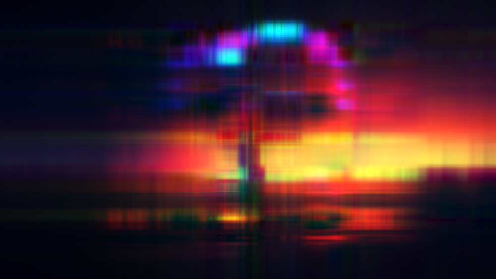            | 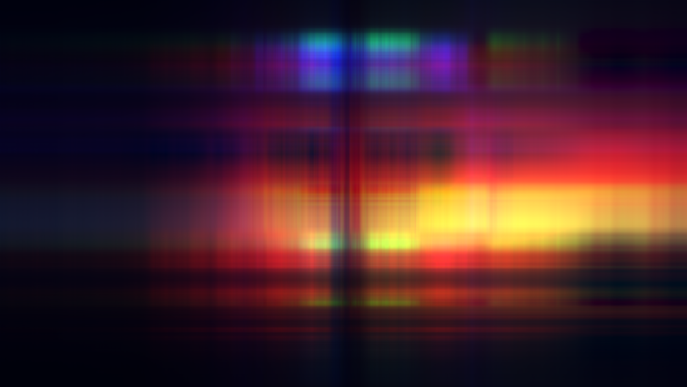            |             |
| Power-iterations |  |  | 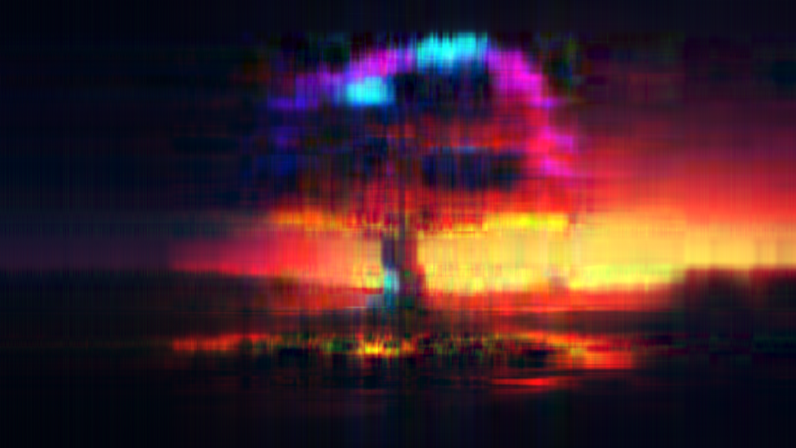 | 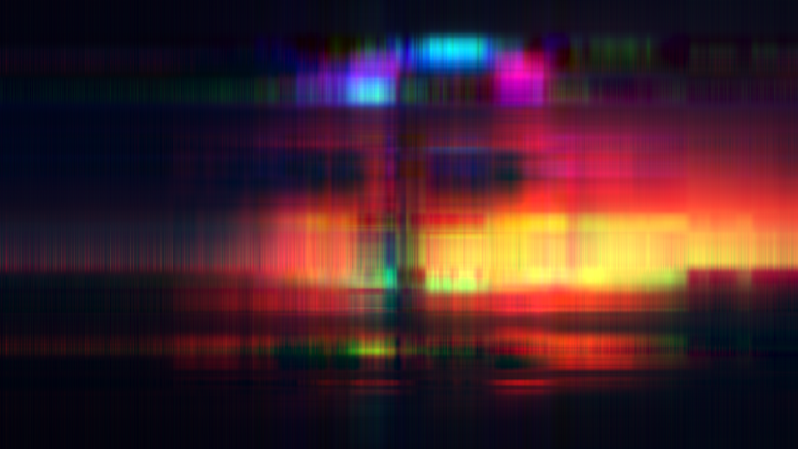 | 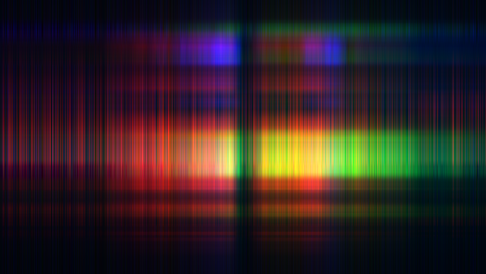 | 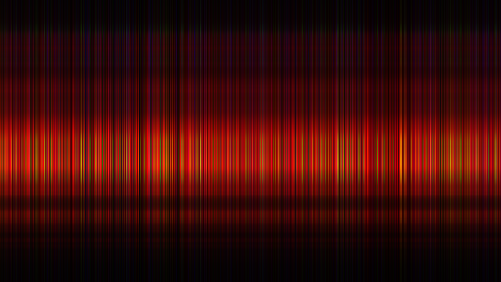 |
| Block-power-iter |  |  |  |  |  | 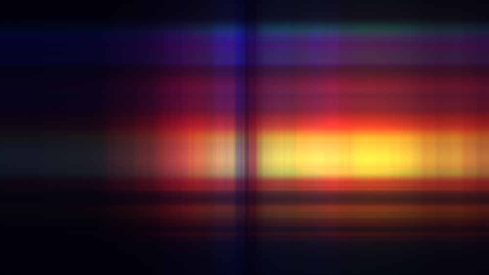 |

| Method\Power     | 2                                                 | 5                                                 | 10                                                 | 20                                                 | 50                                                 | 100                                                 |
|------------------|---------------------------------------------------|---------------------------------------------------|----------------------------------------------------|----------------------------------------------------|----------------------------------------------------|-----------------------------------------------------|
| Numpy            |             |             |             |             |             |             |
| Power-iterations |  |  |  |  |  |  |
| Block-power-iter |  |  |  |  |  |  |

| Method\Power     | 2                                                  | 5                                                  | 10                                                  | 20                                                  | 50                                                  | 100                                                  |
|------------------|----------------------------------------------------|----------------------------------------------------|-----------------------------------------------------|-----------------------------------------------------|-----------------------------------------------------|------------------------------------------------------|
| Numpy            |             |             |             |             | 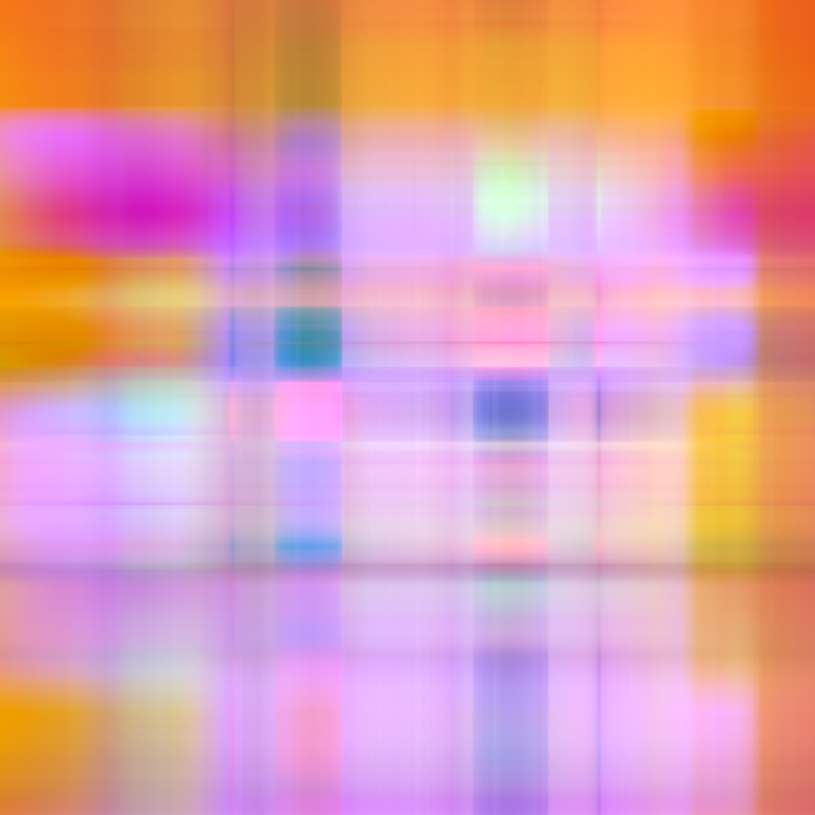            | 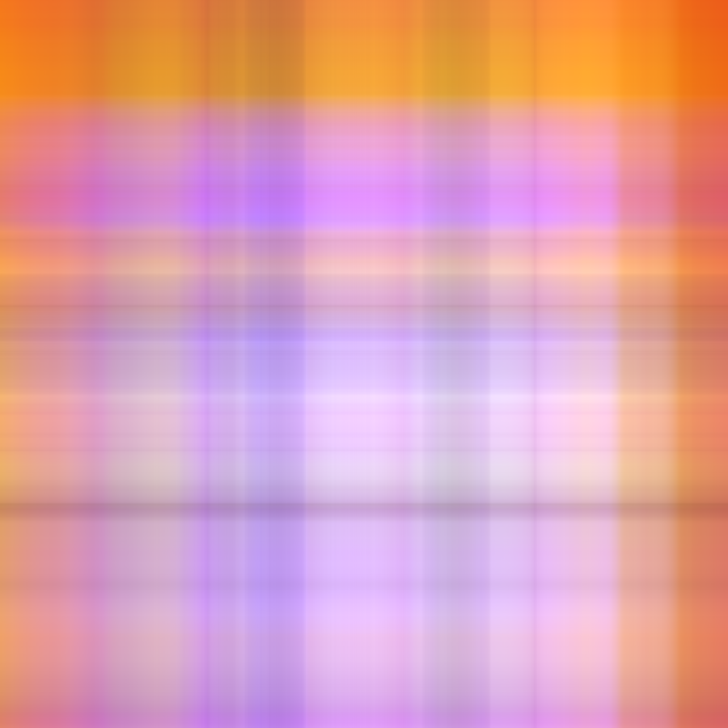            |
| Power-iterations |  |  |  | 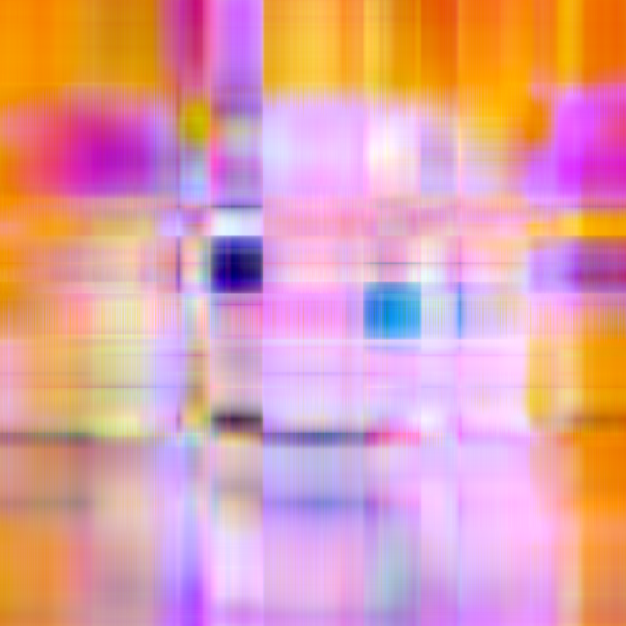 | 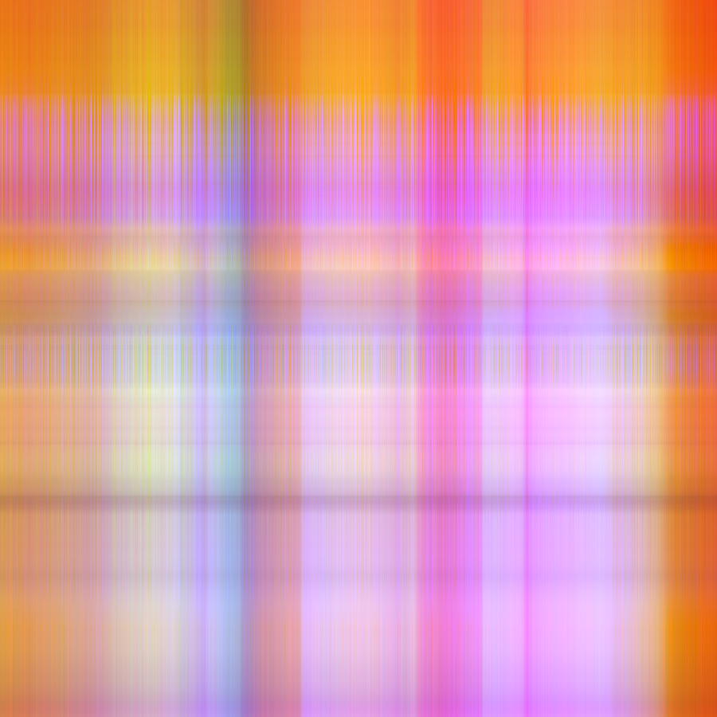 | 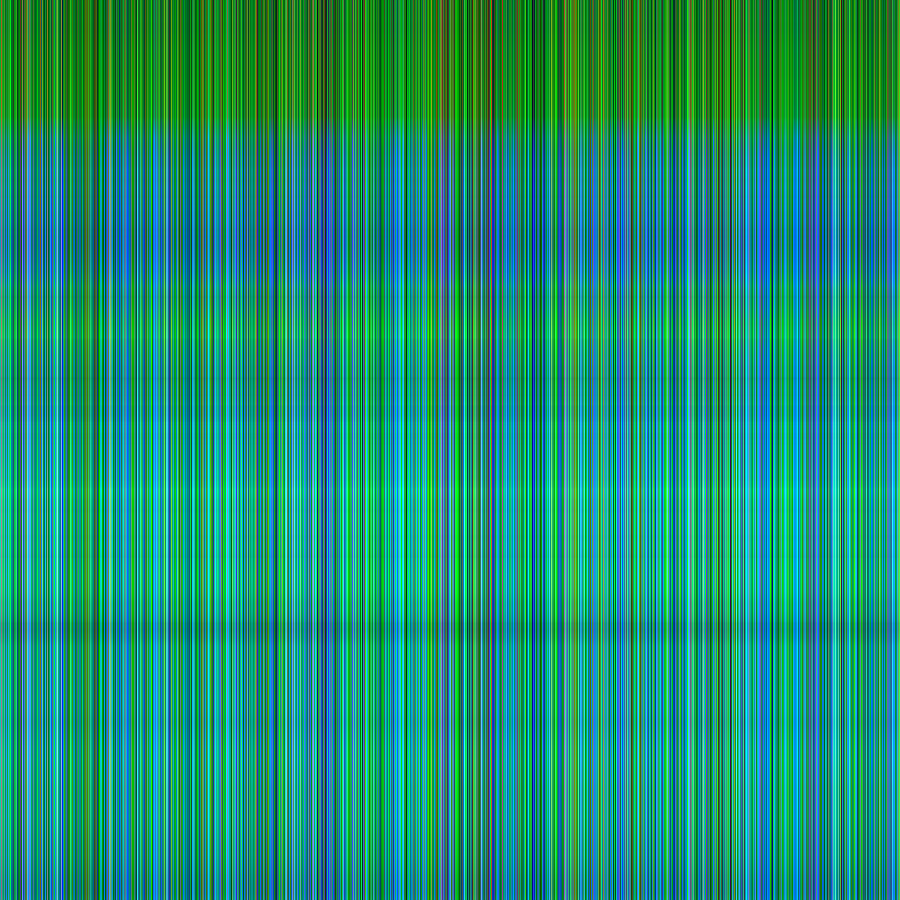 |
| Block-power-iter |  |  |  |  |  |  |

## Выводы
Как видно из таблицы метод numpy и block-power-iter дают схожие результаты для всех изображений, 
однако на практике метод numpy оказался в несколько раз производительнее.
Метод power-iterations дает схожие результаты вплоть до силы компрессии в 20 раз, 
однако потом на нескольких изображениях начинают проявляться специфичные артефакты и искажение цветов. 
Также этот метод оказался самым неэффективным из всех.
